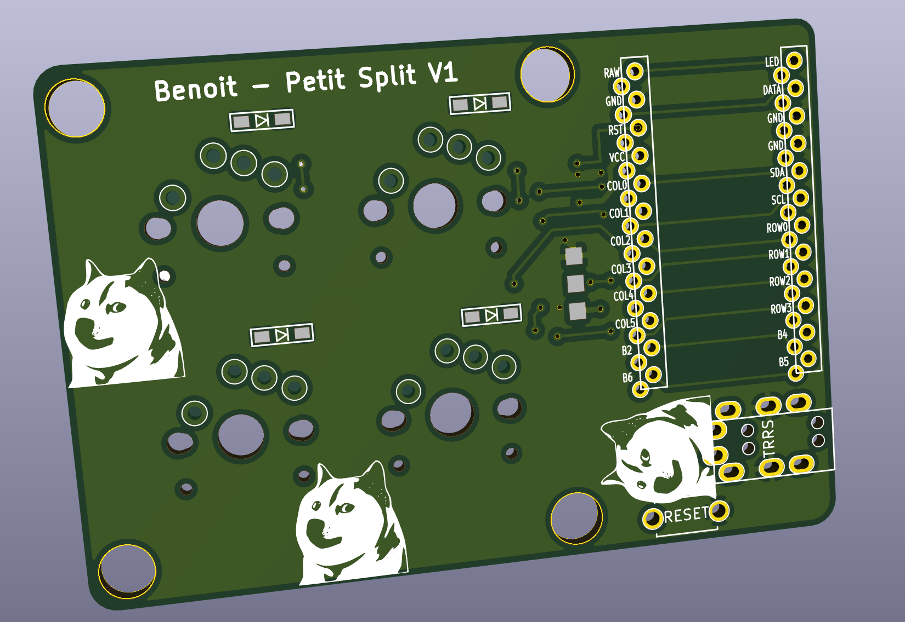
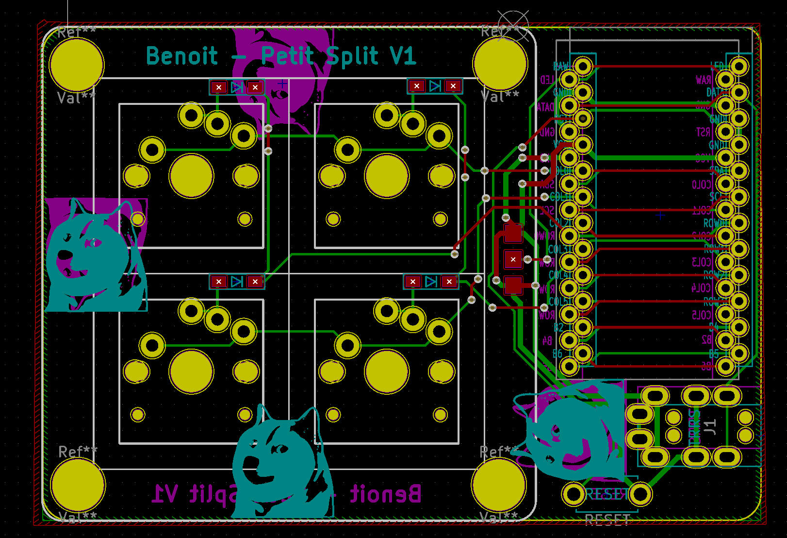

# Petit Split - Benoit version

This is inspired by Foostan book and petit split project.

## Status

Few errors. See report_drc.rpt

## Footprint libraries used

* https://github.com/keebio/Keebio-Parts.pretty
* https://github.com/foostan/kbd
* Shiba included in this repo
